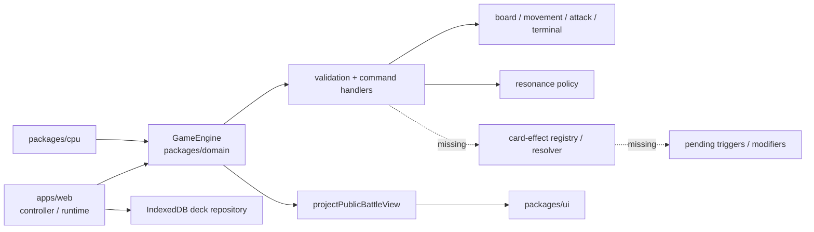
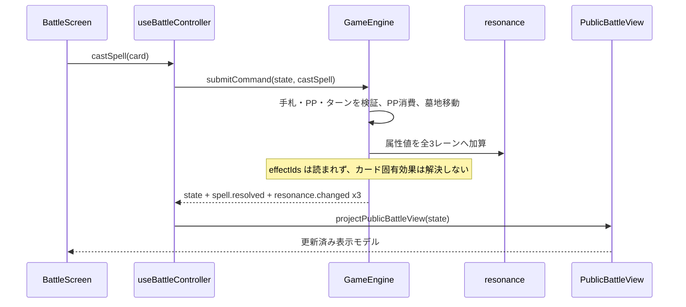
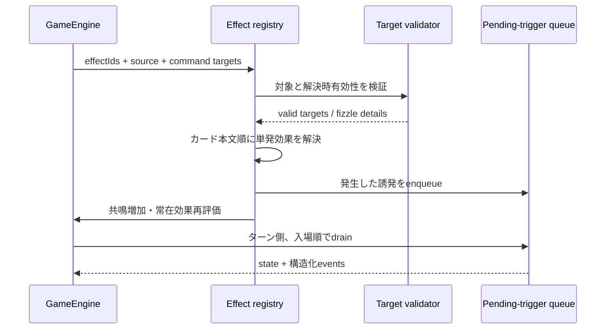

## アーキテクチャ分析

`prj-ankake` は TypeScript npm workspaces のブラウザ専用モジュラーモノリスである。`apps/web` が composition root、`packages/domain` が不変の対戦状態・ルール・公開投影、`packages/cpu` が command 選択、`packages/persistence` が IndexedDB デッキ保存、`packages/ui` が React 表示を担う。サーバー、外部API、メッセージブローカはない。

対戦状態の唯一の書込み境界は `GameEngine.submitCommand` である。召喚、スペル、移動、水共鳴、フェーズ終了を検証して、次の `BattleState` と順序付き `BattleEvent` を返す。この domain transaction は正しい拡張点だが、現状は `effectIds` を解決するディスパッチャ、対象選択の状態、誘発効果キュー、常在効果の再計算層が存在しない。

## 実装済みの共鳴

共鳴はプレイヤーごとの `3 レーン × 5 属性`（0–10、5以上でactive）である。HEAD `755ffda` で、以下の属性共鳴は実装済みになっている。従来のCodeKBにあった「減衰、属性効果、スペル加算、表示が未接続」という評価は古い。

| 属性 | 現在の実装 |
|---|---|
| 火 | active レーンの味方の攻撃に +1。`getEffectiveCreatureAttack` による派生値で、表示と攻撃解決が利用する |
| 水 | `boostCreatureMovement` command により味方1体の移動力を当該ターン +1。レーンごとに1回 |
| 風 | active レーンへのクリーチャー召喚を1回だけ -1 PP（最低1） |
| 光 | 自分の攻撃フェーズ後、active レーンの味方と所有拠点／該当中立拠点を回復 |
| 闇 | active レーンで各ターン最初に破壊された味方の位置へ1/1トークンを生成 |

召喚は元コストの `min(cost, 3)` を当該レーンへ、スペルは全3レーンへ加算する。自分のスタンバイ開始時には15セルを1減衰する。プレイヤーの共鳴と水共鳴の操作可否は `PublicBattleView` に投影済みである。

## 62枚のカード／トークンとカード固有効果の実態

カード一覧は60枚、トークンは2枚で計62枚である。しかしカード固有効果の実装数は **0件** である。`cards.json` はAK-001以外の59枚に `AK-xxx-effect` を設定するが、`effectText` はすべて `Battle effect placeholder ...`、IDに対応する定義・registry・resolver はない。`castSpell` はPP消費、墓地移動、共鳴加算のみをし、召喚・移動・破壊も `effectIds` を読まない。

| カード群 | 仕様にある固有効果の代表 | 実装状態 |
|---|---|---|
| AK-001〜AK-012（火） | ダメージ、召喚時、常在、破壊時、レーン強化 | すべて未実装。AK-001は仕様上効果なし |
| AK-013〜AK-024（水） | 移動補正、ドロー、移動／バウンス、常在、移動誘発 | すべて未実装。AK-014は仕様上効果なし |
| AK-025〜AK-036（風） | PP条件、ランダムサーチ、PP増加、コスト変更、常在 | すべて未実装。AK-035は仕様上効果なし |
| AK-037〜AK-048（光） | 回復、トークン生成、能力補正、効果無効化、常在 | すべて未実装。AK-040は仕様上効果なし |
| AK-049〜AK-060（闇） | 破壊時、破壊、墓地回収／蘇生、誘発、トークン生成 | すべて未実装。AK-053は仕様上効果なし |
| AK-T-001 / AK-T-002 | トークン本体は効果なし | カタログ上は効果なし。闇共鳴だけがAK-T-002相当をハードコード生成するが、catalog token IDを使わない |

よって、正確には「62種類のカード効果」ではなく、**62枚のカード／トークン中、仕様上55枚は効果を持ち、実行用カタログは59件のプレースホルダーIDを持つ**。AK-014、AK-035、AK-040、AK-053は仕様で効果なしにもかかわらずJSONにIDを持つため、効果実装前に正規化が必要である。

## コンポーネント境界

`BattleState` と副作用のない resolver を Battle Domain に閉じ、UI／CPU は公開DTOと command にだけ依存するのが既存境界に適合する。カード効果の実装も外部サービスにせず、domain内に `effect registry → target validation → atomic resolution → trigger drain` を置くべきである。

## Interaction Diagrams

## 実装に必要な境界

| 境界 | 現状 | 必要な責務 |
|---|---|---|
| カタログ | プレースホルダーのID／本文だけ | effect definition、対象、期間、数値、token IDを宣言する |
| command | `targetInstanceId?` だけでレーン、マス、基地、複数／墓地対象を表せない | 型付き選択payloadまたは選択ドラフトを導入する |
| resolver | `effects.ts` の `resolveSimpleSpellEffect` は未使用 | spell、召喚時、破壊時、移動時、常在を共通規約で解決する |
| state | 一時移動以外にmodifier、効果無効化、処理待ちがない | modifier、期限、effect-disabled、使用回数、pending triggerを所有する |
| 破壊 | 闇共鳴を即時解決するだけ | 同時破壊、入場順、発生源喪失を守る破壊時キューを導入する |
| 投影／CPU | CPU共鳴とカード効果対象を十分に投影しない | 合法対象・選択状態を安全に投影し、CPUも同じvalidationを使う |
| event | メッセージ中心 | effect ID、source、targets、変更前後、fizzle理由を `data` に構造化する |

## 設計判断

**ADR-RE-001 — カード効果を Battle Domain 内の宣言的registryとresolverに集約する。**

**Context:** 59件の効果IDが未解決であり、効果は盤面・墓地・共鳴・破壊と同一トランザクションを共有する。  
**Decision:** `effectId` を安定IDとし、domainの型付きregistryからresolverを起動する。状態変更とeventは一回の不変遷移で返す。  
**Consequences:** UI／CPU／テストで規則が分岐せず、登録漏れを検査できる。初期のDSL・対象選択モデル設計が必要になる。  
**Alternatives Rejected:** UIのカードID分岐は規則を重複させるため、外部サービス化は単一ブラウザゲームの原子性を不必要に分断するため採用しない。

**ADR-RE-002 — 持続効果は基礎値を書換えずmodifier再評価で表す。**

**Context:** 火共鳴は既に派生攻撃であり、仕様には常在・一時・永続の攻撃／体力／移動／コスト変更がある。  
**Decision:** 元値、永続的解決結果、一時modifier、常在modifierを区別して、位置・無効化・ターン境界で有効値を再評価する。  
**Consequences:** 解除漏れを避けられる一方、投影とテストは基礎値でなく有効値を扱う。  
**Alternatives Rejected:** `currentAttack` / `currentCost` の直接加減算だけで戻す案は、複数補正と解除順を安全に扱えない。
