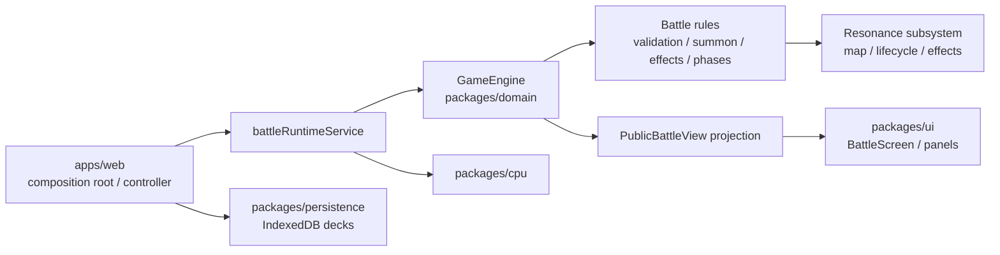
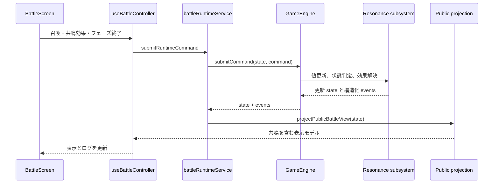

## アーキテクチャ分析

`prj-ankake` は TypeScript npm workspaces によるブラウザ専用のモジュラーモノリスである。`apps/web` が composition root、`packages/domain` が純粋な対戦ルールと状態遷移、`packages/cpu` がドメイン公開状態からの手選択、`packages/persistence` が IndexedDB、`packages/ui` が React 表示を担当する。サーバー API や共有バックエンドは発見されなかった。

共鳴は `BattleState.players[side].resonance` に所有される、プレイヤー単位の 3 レーン × 5 属性の状態である。現在は「状態の格納・0–10 制限・クリーチャー召喚時の更新」までがドメインに実装済みで、仕様で求められる状態判定・効果・表示の境界をまたぐ接続は未実装である。

## コンポーネント境界

`ResonanceMap` は Battle Domain の内部状態であり、UI や CPU が直接参照すべきではない。共鳴のルール判定、使用済み状態、値変化イベントは domain に閉じ、`projectPublicBattleView` を唯一の表示用契約にする。アプリ層はコマンド提出とイベントログへの橋渡しだけを担う。この境界により、CPU と人間プレイヤーは同じ `GameEngine` の規則を利用できる。

## Interaction Diagrams

ターン開始時の必須フローは `resolveAfterPlayPhase` → `resolveStandbyPhase` に集約する。ここで active side の全セルを 1 減衰し、閾値遷移とターン単位の使用可能状態を確定してから PP 回復・ドローを続行する。アタック終了時の光効果は `resolveAttackPhase` の完了境界で解決する。破壊後の闇トークンは、破壊処理の完了後に同じ domain transaction 内で解決する。

## 共鳴の実装差分と影響

| 境界 | 現在の根拠 | 必要な接続・影響 |
|---|---|---|
| 値の増加 | `engine.ts` は召喚時に `max(1, currentCost)` を加算 | `min(card.cost, 3)` を使う。風による軽減・実支払 PP と切り離し、スペルは仕様に応じて全 3 レーンへ増加する |
| ライフサイクル | `decayResonance` はあるが `automaticPhases.ts` 未使用 | 各自スタンバイ開始で当人の 15 値だけを減衰し、状態遷移をイベント化する |
| 効果 | `RESONANCE_ACTIVE_THRESHOLD = 5` はあるが参照なし | 火・水・風・光・闇の継続／使用型効果、レーン別の使用済み状態、固定解決順を domain に実装する |
| コマンド契約 | `BattleCommand` に共鳴効果使用がない | 対象指定を要する水効果の command、検証、CPU の合法手生成を追加する |
| 表示契約 | `PublicBattleView` に resonance がない | 両陣営の 15 値、active、使用済み、説明・操作可否を投影し、`BattleInfoPanels` に表示する |
| 観測性 | `resonance.changed` はメッセージのみ | side/lane/attribute/before/after/threshold transition/reason を `data` に追加し、ログ・UI・テストで利用する |

## 設計判断

**ADR-RE-001 — 共鳴を独立サービスではなく Battle Domain 内のサブシステムとして保つ。**

理由は、共鳴がコスト、召喚、移動、攻撃、破壊、回復、ターン境界と同一の不変 `BattleState` transaction に属するためである。外部サービスや UI 側の派生計算にすると、CPU と人間操作、イベント順、再現性が分岐する。代償として `engine.ts` の直接分岐を増やさず、`resonance` 配下に lifecycle/effect/policy を凝集させる必要がある。

**ADR-RE-002 — 効果値はカード状態を永続的に書換えず、ルール評価または明示的な一時状態として表す。**

火の攻撃力、風のコスト、水の移動力は閾値・レーン移動・減衰で即時に失効する。`currentAttack` / `currentCost` を直接加算して戻す実装は解除漏れを生むため、基礎値と一時修正／使用済み状態を分離する。光・闇のようなイベント時効果のみが明示的 state 更新を行う。
