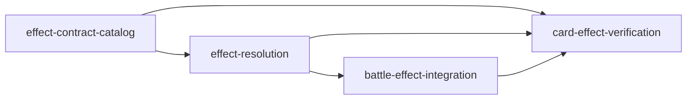

# Unit Dependency DAG

## Topology

`effect-contract-catalog` は定義と型の唯一の静的所有者である。`effect-resolution` はその定義と型を使う。`battle-effect-integration` は解決結果を既存エンジンと公開投影へ写像する。`card-effect-verification` は全ての公開された振る舞いを検証する。



テキスト表現: `effect-resolution` は `effect-contract-catalog` に依存する。`battle-effect-integration` は `effect-resolution` に依存する。`card-effect-verification` は残る三単位すべてに依存する。循環依存はない。

## Integration Contracts

| 接続元 | 接続先 | 契約 |
| --- | --- | --- |
| effect-contract-catalog | effect-resolution | `StaticCatalogSnapshot`、effect definition、selection/result/event/trigger の型 |
| effect-resolution | battle-effect-integration | 不変 state、順序付き event、`BattleRngState`、成功/不発/拒否の結果 |
| battle-effect-integration | card-effect-verification | command、状態、event、公開候補および UI/CPU の合法性観測点 |
| effect-contract-catalog / effect-resolution | card-effect-verification | 62-entry coverage、仕様テキスト、効果ごとの期待状態とイベント |

## Parallel Development Opportunities

トポロジ上、`effect-contract-catalog` が完了した後は、契約固定済みのカタログ検証テストを `card-effect-verification` に追加できる。残りの独立可能な作業は、ここで優先順位を指定せず、依存を満たす範囲で並行化できる。

```yaml
units:
  - name: effect-contract-catalog
    kind: library
    depends_on: []
  - name: effect-resolution
    kind: library
    depends_on: [effect-contract-catalog]
  - name: battle-effect-integration
    kind: library
    depends_on: [effect-resolution]
  - name: card-effect-verification
    kind: library
    depends_on: [effect-contract-catalog, effect-resolution, battle-effect-integration]
```
