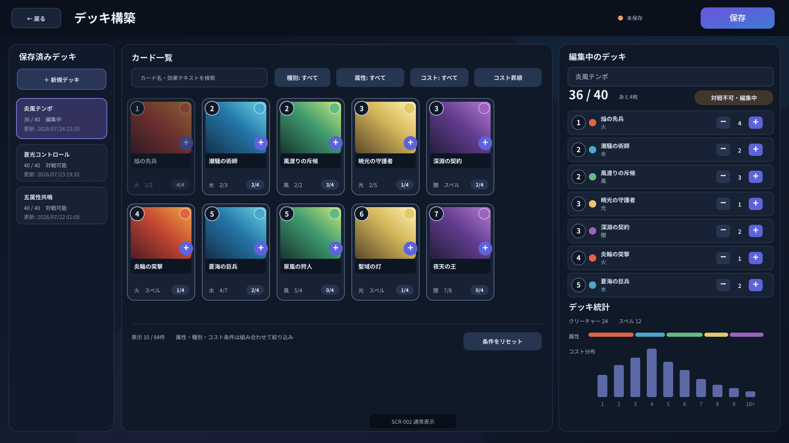
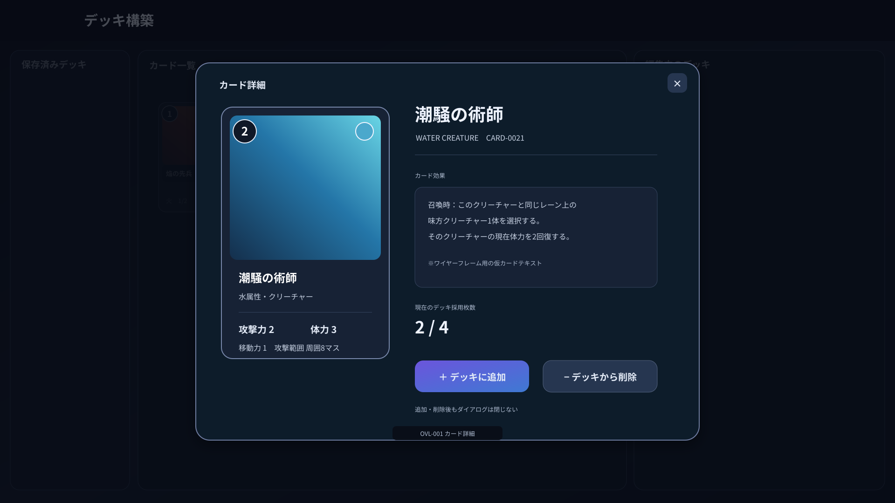

# Project Ankake 画面詳細要件仕様書

## 1. SCR-002 デッキ構築画面

### 1.1 目的

デッキ構築画面は、カード一覧からカードを選択し、CPU対戦で使用するデッキを新規作成、編集、保存および削除するための画面とする。

プレイヤーは、本画面で以下を行う。

- 保存済みデッキを選択する。
- 新しいデッキを作成する。
- デッキ名を編集する。
- カードを検索、絞り込みおよび並べ替えする。
- カードをデッキへ追加する。
- カードをデッキから削除する。
- カードの詳細を確認する。
- デッキの構成および対戦可否を確認する。
- デッキを保存する。
- デッキを削除する。
- メニュー画面へ戻る。

---

### 1.2 画面構成方針

画面を以下の3つの主要領域に分ける。

1. 保存済みデッキを選択する左側領域
2. デッキ統計を確認し、使用可能なカードを探して追加する中央領域
3. 編集中デッキの内容を確認する右側領域

カード一覧と編集中デッキを同時に表示し、別画面へ移動せずにカードの追加と削除を繰り返せる構成とする。

画面は以下の領域で構成する。

| 領域ID | 領域名 | 概要 |
|---|---|---|
| AREA-001 | ヘッダー領域 | 戻る操作、画面名、未保存状態および保存操作を表示する |
| AREA-002 | 保存済みデッキ領域 | 保存済みデッキの一覧と新規作成操作を表示する |
| AREA-003 | 検索・絞り込み領域 | カード検索、種別、属性、コストおよび並び順の指定を行う |
| AREA-004 | カード一覧領域 | デッキへ追加可能なカードをカードイラスト付きで表示する |
| AREA-005 | デッキ情報領域 | デッキ名、合計枚数、対戦可否および削除操作を表示する |
| AREA-006 | デッキ内容領域 | 編集中デッキに含まれるカードを同名カード単位で表示する |
| AREA-007 | デッキ統計領域 | 中央領域の最上部で、カード種別、属性およびコスト分布を表示する |

---

### 1.3 画面イメージ

#### 1.3.1 通常表示



通常表示では、以下の配置とする。

- 画面上部：ヘッダー領域
- 画面左側：保存済みデッキ領域
- 画面中央最上部：デッキ統計領域
- 画面中央上部：検索・絞り込み領域
- 画面中央：カード一覧領域
- 画面右側上部：デッキ情報領域
- 画面右側中央：デッキ内容領域

#### 1.3.2 カード詳細ダイアログ表示



カード詳細ダイアログは画面中央に表示し、背面のデッキ構築画面を暗く表示する。

---

### 1.4 UI要素一覧

| UI要素ID | 名称 | 種別 | 概要 |
|---|---|---|---|
| BTN-001 | 戻るボタン | ボタン | メニュー画面へ戻る |
| TXT-001 | 画面タイトル | テキスト | `デッキ構築`を表示する |
| TXT-002 | 未保存表示 | テキスト | 編集内容が未保存であることを表示する |
| BTN-002 | 保存ボタン | ボタン | 編集中のデッキを保存する |
| BTN-003 | 新規デッキボタン | ボタン | 空のデッキを新規作成する |
| LST-001 | 保存済みデッキ一覧 | 一覧 | 保存済みデッキを表示し、編集対象を選択する |
| INP-001 | カード検索入力 | テキスト入力 | カード名または効果テキストを検索する |
| FLT-001 | カード種別フィルター | フィルター | クリーチャーおよびスペルを絞り込む |
| FLT-002 | 属性フィルター | フィルター | 火、水、風、光および闇属性を絞り込む |
| FLT-003 | コストフィルター | フィルター | 元のコストでカードを絞り込む |
| SEL-001 | 並び順選択 | セレクト | カード一覧の並び順を変更する |
| BTN-004 | 絞り込み解除ボタン | ボタン | 検索条件とフィルターを初期状態へ戻す |
| GRD-001 | カード一覧 | グリッド | デッキ投入可能なカードを表示する |
| CRD-001 | カード一覧項目 | カード | カードイラストおよび主要情報を表示する |
| BTN-005 | カード追加ボタン | ボタン | 対象カードをデッキへ1枚追加する |
| BTN-006 | カード詳細ボタン | ボタン | カード詳細ダイアログを表示する |
| INP-002 | デッキ名入力 | テキスト入力 | 編集中のデッキ名を入力する |
| TXT-003 | デッキ枚数表示 | テキスト | 現在枚数と上限枚数を表示する |
| TXT-004 | 対戦可否表示 | ステータス | 編集中デッキが対戦可能か表示する |
| BTN-007 | デッキ削除ボタン | ボタン | 選択中の保存済みデッキを削除する |
| LST-002 | デッキ内容一覧 | 一覧 | 編集中デッキのカードを同名カード単位で表示する |
| BTN-008 | 採用枚数追加ボタン | ボタン | 対象カードをデッキへ1枚追加する |
| BTN-009 | 採用枚数削除ボタン | ボタン | 対象カードをデッキから1枚削除する |
| TXT-005 | カード種別統計 | テキスト・グラフ | クリーチャーとスペルの採用枚数を表示する |
| TXT-006 | 属性統計 | テキスト・グラフ | 属性ごとの採用枚数を表示する |
| TXT-007 | コスト分布 | グラフ | 元のコストごとの採用枚数を表示する |
| OVL-001 | カード詳細ダイアログ | ダイアログ | カードイラストとカードの固定情報を拡大表示する |
| OVL-002 | デッキ保存確認ダイアログ | ダイアログ | 同名デッキへの上書きを確認する |
| OVL-003 | デッキ削除確認ダイアログ | ダイアログ | 保存済みデッキの削除を確認する |
| OVL-004 | 未保存変更確認ダイアログ | ダイアログ | 未保存の編集内容を保存または破棄するか確認する |
| OVL-007 | エラーダイアログ | ダイアログ | データ取得、保存または削除に失敗した場合に表示する |
| OVL-008 | ローディングオーバーレイ | オーバーレイ | 初期表示、保存または削除処理中に表示する |
| NTF-001 | 完了通知 | 通知 | 保存や削除の完了を一時的に表示する |

---

### 1.5 初期表示

デッキ構築画面を表示した場合、以下の状態とする。

#### 保存済みデッキが存在する場合

- 更新日時が最も新しい保存済みデッキを選択する。
- 選択したデッキの名前、カード内容、統計および対戦可否を表示する。
- 未保存表示を非表示とする。
- 保存ボタンを非活性とする。
- 保存済みデッキ一覧では、選択中のデッキを強調表示する。

#### 保存済みデッキが存在しない場合

- 空の新規デッキを編集状態で表示する。
- デッキ名の初期値を`新規デッキ`とする。
- 未保存表示を表示する。
- デッキ削除ボタンを非活性とする。
- デッキ内容一覧には空状態メッセージを表示する。

#### カード一覧

- デッキ投入可能なカードのみを表示する。
- 検索文字列は空とする。
- カード種別、属性およびコストフィルターは`すべて`とする。
- 並び順は、元のコスト昇順、カード名昇順とする。
- 一覧のスクロール位置は先頭とする。

初期表示に必要なデータの取得中はローディングオーバーレイを表示し、画面操作を受け付けない。

---

### 1.6 表示仕様

#### 1.6.1 ヘッダー領域

ヘッダー領域には、以下を表示する。

- 戻るボタン
- `デッキ構築`の画面タイトル
- 未保存表示
- 保存ボタン

未保存表示は、最後に保存した内容から以下のいずれかが変更された場合に表示する。

- デッキ名
- 採用カード
- 各カードの採用枚数

未保存表示は`未保存`の文字と小さな警告色のマークで表現する。

#### 1.6.2 保存済みデッキ領域

保存済みデッキ領域には、新規デッキボタンと保存済みデッキ一覧を表示する。

保存済みデッキ一覧の各項目には、以下を表示する。

- デッキ名
- 合計カード枚数
- 対戦可否
- 更新日時

対戦可能なデッキには`対戦可能`を表示する。

対戦不可能なデッキには`編集中`を表示する。

一覧は更新日時の降順で表示する。

#### 1.6.3 検索・絞り込み領域

カード検索入力は、以下を検索対象とする。

- カード名
- 効果テキスト

検索は大文字と小文字、全角と半角の差を可能な範囲で無視する。

フィルターは以下を指定できる。

##### カード種別

- すべて
- クリーチャー
- スペル

##### 属性

- すべて
- 火
- 水
- 風
- 光
- 闇

複数の属性を同時に選択できる。

##### コスト

- すべて
- 0
- 1
- 2
- 3
- 4
- 5
- 6
- 7
- 8
- 9
- 10以上

検索条件と異なる種類のフィルターはAND条件で適用する。

属性を複数選択した場合は、選択したいずれかの属性に一致するカードを表示する。

並び順は以下から選択できる。

- コスト昇順
- コスト降順
- カード名昇順
- カード名降順
- 属性順
- カード種別順

#### 1.6.4 カード一覧領域

カード一覧はカードイラストを主体としたグリッド形式で表示する。

カード一覧項目には、以下を表示する。

- カードイラスト
- カード名
- カード種別
- 属性アイコン
- 元のコスト
- クリーチャーの場合は元の攻撃力および元の最大体力
- スペルの場合はスペルであることを示す種別表示
- 現在のデッキ採用枚数
- カード追加ボタン
- カード詳細ボタン

現在のデッキ採用枚数は`2 / 4`の形式で表示する。

カード画像の読み込みに失敗した場合は、カード種別と属性を用いた共通の代替画像を表示する。

絞り込み結果が0件の場合は、カード一覧領域に以下を表示する。

```text
条件に一致するカードがありません
```

#### 1.6.5 デッキ情報領域

デッキ情報領域には、以下を表示する。

- デッキ名入力
- デッキ枚数
- 対戦可否
- デッキ削除ボタン

デッキ枚数は`現在枚数 / 40`の形式で表示する。

40枚未満の場合は、不足枚数を表示する。

```text
36 / 40
あと4枚
```

40枚を超える操作は許可しない。

#### 1.6.6 デッキ内容領域

デッキ内容一覧は、同名カードを1行にまとめて表示する。

各行には、以下を表示する。

- カードの縮小イラスト
- 元のコスト
- 属性アイコン
- カード名
- カード種別
- クリーチャーの場合は元の攻撃力および元の最大体力
- 採用枚数
- 採用枚数追加ボタン
- 採用枚数削除ボタン
- カード詳細ボタン

デッキ内容一覧の既定の並び順は、元のコスト昇順、カード名昇順とする。

デッキ内のカード順はゲーム上の意味を持たないため、手動並べ替え機能は設けない。

デッキが空の場合は、以下を表示する。

```text
カード一覧からカードを追加してください
```

#### 1.6.7 デッキ統計領域

デッキ統計領域には、以下を表示する。

- クリーチャーの採用枚数
- スペルの採用枚数
- 火、水、風、光および闇属性の採用枚数
- 元のコストごとの採用枚数

コスト分布は棒グラフで表示する。各棒には区分と採用枚数を表示する。

棒の高さは、最も採用枚数が多いコスト区分をグラフ領域の最大高さとして、その区分に対する採用枚数の比率で表示する。採用枚数が0の区分は高さ0で表示する。

コスト分布は、`1以下`、`2`、`3`、`4`、`5`、`6`、`7`および`8以上`の区分で表示する。コスト8以上のカードは、`8以上`にまとめて表示する。

デスクトップ幅では、カード種別・属性の採用枚数を左側のコンパクトなグリッド、コスト分布を右側の棒グラフとして横並びに表示する。モバイル幅では、この2つを縦に並べて表示する。

---

### 1.7 操作仕様

#### 1.7.1 戻るボタン

未保存の変更がない状態で戻るボタンを選択した場合、メニュー画面へ遷移する。

未保存の変更がある場合は、未保存変更確認ダイアログを表示する。

未保存変更確認ダイアログでは、以下を選択できる。

| 選択肢 | 処理 |
|---|---|
| 保存して戻る | 入力内容を検証し、保存成功後にメニュー画面へ遷移する |
| 保存せず戻る | 未保存の変更を破棄し、メニュー画面へ遷移する |
| キャンセル | ダイアログを閉じ、デッキ構築画面に留まる |

#### 1.7.2 新規デッキボタン

新規デッキボタンを選択した場合、空の新規デッキを編集状態で表示する。

現在のデッキに未保存の変更がある場合は、新規デッキへ切り替える前に未保存変更確認ダイアログを表示する。

新規デッキ名は、既存のデッキ名と重複しないように以下の形式で設定する。

```text
新規デッキ
新規デッキ 2
新規デッキ 3
```

#### 1.7.3 保存済みデッキの選択

保存済みデッキ一覧の項目を選択した場合、対象デッキを編集状態で表示する。

現在のデッキに未保存の変更がある場合は、対象デッキへ切り替える前に未保存変更確認ダイアログを表示する。

選択処理中は対象項目にローディング表示を行い、重複選択を受け付けない。

#### 1.7.4 カードの追加

カード追加ボタンまたはデッキ内容一覧の採用枚数追加ボタンを選択した場合、対象カードをデッキへ1枚追加する。

追加後は以下を即時更新する。

- カード一覧上の採用枚数
- デッキ内容一覧
- デッキ枚数
- 対戦可否
- カード種別統計
- 属性統計
- コスト分布
- 未保存表示
- 保存ボタンの活性状態

以下の場合、カード追加ボタンを非活性とする。

- デッキが40枚である。
- 対象カードをすでに4枚採用している。
- 対象カードがデッキ投入不可である。
- 保存、削除またはデータ読み込み処理中である。

非活性のカード追加ボタンへポインターを合わせた場合、追加できない理由をツールチップで表示する。

#### 1.7.5 カードの削除

デッキ内容一覧の採用枚数削除ボタンを選択した場合、対象カードをデッキから1枚削除する。

削除後は、カード追加時と同じ関連表示を即時更新する。

採用枚数が0枚になった場合、対象カードの行をデッキ内容一覧から削除する。

#### 1.7.6 カード詳細の表示

以下の操作でカード詳細ダイアログを表示する。

- カード一覧項目のカードイラストまたはカード名を選択する。
- カード詳細ボタンを選択する。
- デッキ内容一覧のカードイラストまたはカード名を選択する。

カード詳細ダイアログには、カードの固定情報を表示する。

カード一覧から開いた場合は、`デッキに追加`ボタンを表示する。

デッキ内容一覧から開いた場合は、以下を表示する。

- `デッキに追加`ボタン
- `デッキから削除`ボタン
- 現在の採用枚数

追加または削除できない場合は、該当ボタンを非活性とし、理由を表示する。

#### 1.7.7 デッキ名の編集

デッキ名入力を変更した場合、未保存状態とする。

前後の空白は保存時に除去する。

改行および制御文字は入力できない。

#### 1.7.8 保存ボタン

保存ボタンは、最後に保存した内容から変更がある場合に活性とする。

保存ボタンを選択した場合、以下を処理する。

1. デッキ名とデッキ内容を検証する。
2. 新規デッキの場合は新規保存する。
3. 保存済みデッキの場合は対象デッキを更新する。
4. 保存成功後、未保存表示を非表示にする。
5. 保存ボタンを非活性にする。
6. 保存済みデッキ一覧の内容と並び順を更新する。
7. `デッキを保存しました`の完了通知を表示する。

通常の更新保存では、確認ダイアログを表示しない。

入力したデッキ名が別の保存済みデッキと重複する場合は、デッキ保存確認ダイアログを表示する。

デッキ保存確認ダイアログで上書きを確定した場合は、同名の保存済みデッキを現在の内容で置き換える。

#### 1.7.9 デッキ削除ボタン

保存済みデッキを選択している場合に、デッキ削除ボタンを活性とする。

デッキ削除ボタンを選択した場合、デッキ削除確認ダイアログを表示する。

削除を確定した場合は対象デッキを削除する。

削除成功後は、以下の順で編集対象を決定する。

1. 保存済みデッキが残っている場合、更新日時が最も新しいデッキを選択する。
2. 保存済みデッキが存在しない場合、空の新規デッキを表示する。

削除後、`デッキを削除しました`の完了通知を表示する。

#### 1.7.10 検索、絞り込みおよび並べ替え

カード検索入力を変更した場合、入力停止から150ミリ秒後にカード一覧を更新する。

フィルターまたは並び順を変更した場合は、カード一覧を即時更新する。

絞り込み解除ボタンを選択した場合、以下を初期状態へ戻す。

- 検索文字列
- カード種別
- 属性
- コスト
- 並び順

検索および絞り込みの変更は、編集中デッキの未保存状態に影響しない。

---

### 1.8 デッキ構築ルールと対戦可否

デッキ構築ルールは以下とする。

- デッキ枚数は40枚とする。
- 同名カードは4枚まで採用できる。
- 採用できる属性数に制限は設けない。
- 火、水、風、光および闇属性を自由に混ぜて構築できる。
- デッキ投入不可のカードはカード一覧に表示しない。

以下をすべて満たすデッキを対戦可能とする。

- デッキ名が有効である。
- カード枚数が40枚である。
- 同名カードの採用枚数が4枚以下である。
- すべてのカードがデッキ投入可能である。
- 参照しているカードデータが存在する。

40枚未満のデッキも保存できる。

対戦不可能なデッキには、理由を表示する。

例：

```text
対戦不可：カードが4枚不足しています
```

---

### 1.9 入力チェック

#### 1.9.1 デッキ名

デッキ名は以下を満たす必要がある。

- 前後の空白を除去した後、1文字以上30文字以内である。
- 改行を含まない。
- 制御文字を含まない。

デッキ名が未入力または不正な場合は、入力欄の下にエラーメッセージを表示する。

#### 1.9.2 カード枚数

カード追加操作によって、デッキ枚数が40枚を超えないようにする。

同名カードの採用枚数が4枚を超えないようにする。

不正なデータを読み込んだことで制限を超えている場合は、デッキを対戦不可かつ保存不可とし、エラーメッセージを表示する。

#### 1.9.3 保存条件

以下の場合は保存ボタンを非活性とする。

- デッキ名が不正である。
- デッキ内容に不正なカードデータが含まれている。
- 保存処理中である。
- 最後に保存した内容から変更がない。

カード枚数が40枚未満であることは、保存を妨げない。

---

### 1.10 UI状態

| 状態 | 表示・挙動 |
|---|---|
| 通常 | 保存済みデッキ、カード一覧および編集中デッキを操作できる |
| 新規デッキ編集中 | デッキ削除ボタンを非活性とし、未保存表示を表示する |
| 未保存変更あり | 未保存表示を表示し、保存ボタンを活性とする |
| 対戦可能 | 対戦可否表示を肯定的な表示とする |
| 対戦不可能 | 不足枚数または不正理由を表示する |
| デッキ上限到達 | すべてのカード追加ボタンを非活性とする |
| 同名4枚到達 | 対象カードの追加ボタンのみ非活性とする |
| 検索結果なし | カード一覧に空状態メッセージを表示する |
| 保存処理中 | 編集操作を一時的に無効化し、ローディング表示を行う |
| 削除処理中 | 編集操作を一時的に無効化し、ローディング表示を行う |
| エラー発生 | エラーダイアログを表示し、背面操作を無効化する |

---

### 1.11 ダイアログおよび通知

#### 1.11.1 カード詳細ダイアログ

カード詳細ダイアログには、以下を表示する。

- カードイラスト
- カード名
- カード種別
- 属性
- 元のコスト
- 効果テキスト
- クリーチャーの場合は元の攻撃力、元の最大体力、元の移動力および基本攻撃範囲
- 現在のデッキ採用枚数
- デッキに追加ボタン
- 必要に応じてデッキから削除ボタン
- 閉じるボタン

ダイアログ表示中は背面画面を操作できない。

以下の操作でダイアログを閉じる。

- 閉じるボタン
- Escapeキー
- ダイアログ外の背景選択

カードの追加または削除を行っても、ダイアログは閉じない。

#### 1.11.2 デッキ保存確認ダイアログ

別の保存済みデッキと同じ名前で保存しようとした場合に表示する。

以下を選択できる。

- 上書きする
- キャンセル

#### 1.11.3 デッキ削除確認ダイアログ

削除対象のデッキ名を表示し、削除操作を確認する。

以下を選択できる。

- 削除する
- キャンセル

#### 1.11.4 未保存変更確認ダイアログ

以下の操作時に未保存の変更がある場合に表示する。

- メニュー画面へ戻る。
- 新規デッキを作成する。
- 別の保存済みデッキを選択する。

以下を選択できる。

- 保存して続行
- 保存せず続行
- キャンセル

#### 1.11.5 完了通知

保存または削除が成功した場合、画面右上に完了通知を表示する。

完了通知は3秒後に自動で非表示とする。

完了通知は画面操作を妨げない。

---

### 1.12 ローディング仕様

以下の処理中はローディングオーバーレイまたは対象領域内のローディング表示を使用する。

- 初期データの取得
- 保存済みデッキの切り替え
- デッキの保存
- デッキの削除

画面全体を操作できない処理では、ローディングオーバーレイを表示する。

保存済みデッキの内容取得など、対象領域だけを更新できる処理では、対象領域内にローディング表示を行う。

処理が200ミリ秒以内に完了した場合はローディング表示を省略する。

ローディング表示を開始した場合は、ちらつきを防ぐため300ミリ秒以上表示する。ただし、エラー発生時は即時に閉じてエラーダイアログへ切り替える。

---

### 1.13 エラー時の挙動

以下の処理に失敗した場合、エラーダイアログを表示する。

- カード一覧の取得
- 保存済みデッキ一覧の取得
- デッキ内容の取得
- デッキの保存
- デッキの削除
- カード画像の取得

再実行によって復旧する可能性がある場合は、再試行ボタンを表示する。

デッキ保存に失敗した場合は、編集内容を保持し、未保存状態を維持する。

デッキ削除に失敗した場合は、対象デッキを一覧から削除せず、編集状態を維持する。

カード画像の取得だけに失敗した場合は、画面全体のエラーダイアログを表示せず、代替画像を表示する。必要に応じてカード画像の再読み込み操作を提供する。

カード一覧または保存済みデッキ一覧を取得できず、画面を継続できない場合は、メニュー画面へ戻るボタンをエラーダイアログに表示する。

---

### 1.14 取得・更新データ

#### 1.14.1 取得データ

| データ | 用途 |
|---|---|
| カード一覧 | カード一覧表示、検索、絞り込みおよび統計計算 |
| カードイラスト | カード一覧、デッキ内容一覧およびカード詳細表示 |
| 保存済みデッキ一覧 | 編集対象デッキの選択 |
| 選択したデッキの内容 | デッキ内容および統計の表示 |
| デッキ更新日時 | 保存済みデッキ一覧の表示と並べ替え |

#### 1.14.2 更新データ

| データ | 更新契機 |
|---|---|
| デッキ名 | デッキ保存時 |
| デッキに含まれるカードと採用枚数 | デッキ保存時 |
| デッキ更新日時 | デッキ保存時 |
| 保存済みデッキ | 新規保存、更新保存または削除時 |

検索条件、フィルターおよびカード一覧のスクロール位置は、画面内だけで使用する一時的な状態とし、デッキデータには保存しない。

---

### 1.15 演出仕様

#### 1.15.1 初期表示

画面表示時は、以下を300ミリ秒から500ミリ秒程度で表示する。

- ヘッダーを上方向からフェードインする。
- 保存済みデッキ領域を左方向からフェードインする。
- カード一覧領域をフェードインする。
- デッキ内容領域を右方向からフェードインする。

演出中も、対象領域の表示が完了した時点から操作を受け付ける。ただし、データ読み込み中は操作を受け付けない。

#### 1.15.2 カード追加・削除

カード追加時は、以下の演出を行う。

- カード一覧項目を短時間強調表示する。
- デッキ内容一覧の対象行を強調表示する。
- デッキ枚数を軽く拡大して更新する。

カード削除時は、採用枚数が0になる場合のみ、対象行を150ミリ秒程度でフェードアウトする。

#### 1.15.3 カード詳細ダイアログ

カード詳細ダイアログは、背景の暗転とともに150ミリ秒から200ミリ秒で拡大しながら表示する。

閉じる場合は逆方向の演出を行う。

演出はカード情報の読みやすさを妨げないものとする。

---

### 1.16 音響仕様

デッキ構築画面では、以下の音を再生しない。

- BGM
- カードの追加音
- カードの削除音
- ボタンのホバー音
- ボタンの決定音
- 保存完了音
- エラー通知音

将来音響を追加する場合は、共通音響仕様で別途定義する。

---

### 1.17 対象外とする操作

本画面では、以下の操作を設けない。

- カードのドラッグ＆ドロップによる追加または削除
- デッキ内カードの手動並べ替え
- デッキ内容の対戦中の並び順指定
- デッキコードのインポートまたはエクスポート
- デッキの共有
- 複数デッキの一括削除

---
