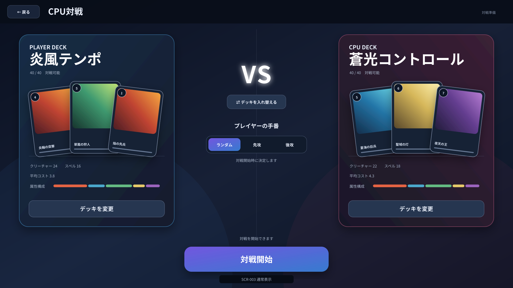
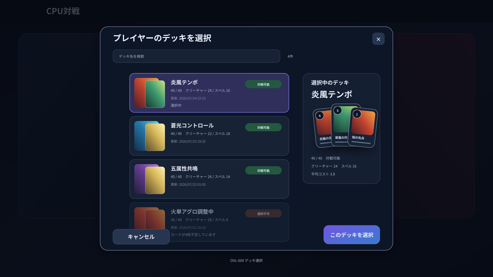

# Project Ankake 画面詳細要件仕様書

## 1. SCR-003 対戦準備画面

### 1.1 目的

対戦準備画面は、CPU対戦でプレイヤーとCPUが使用するデッキ、およびプレイヤーの先攻・後攻の決定方式を設定し、対戦を開始するための画面とする。

プレイヤーは、本画面で以下を行う。

- プレイヤーが使用する保存済みデッキを選択する。
- CPUが使用する保存済みデッキを選択する。
- 選択した各デッキの概要を確認する。
- プレイヤーとCPUのデッキを入れ替える。
- プレイヤーをランダム、先攻または後攻に設定する。
- 設定した条件で対戦を開始する。
- メニュー画面へ戻る。

CPUの強さおよび思考方式は1種類とし、本画面に選択項目を設けない。

---

### 1.2 画面構成方針

画面中央でプレイヤーとCPUの対戦関係が直感的に分かるように、左右対称に近い構成とする。

- 画面左側にプレイヤーが使用するデッキを表示する。
- 画面右側にCPUが使用するデッキを表示する。
- 画面中央に対戦を示す`VS`表示、デッキ入れ替え操作および先攻・後攻設定を配置する。
- 画面下部に対戦開始ボタンを大きく表示する。

画面は以下の領域で構成する。

| 領域ID | 領域名 | 概要 |
|---|---|---|
| AREA-001 | ヘッダー領域 | 戻る操作と画面名を表示する |
| AREA-002 | プレイヤーデッキ領域 | プレイヤーが使用するデッキと概要を表示する |
| AREA-003 | 対戦条件領域 | VS表示、デッキ入れ替えおよび先攻・後攻設定を表示する |
| AREA-004 | CPUデッキ領域 | CPUが使用するデッキと概要を表示する |
| AREA-005 | 対戦開始領域 | 設定内容の状態と対戦開始操作を表示する |

---

### 1.3 画面イメージ

#### 1.3.1 通常表示



通常表示では、以下の配置とする。

- 画面上部：ヘッダー領域
- 画面左側：プレイヤーデッキ領域
- 画面中央：対戦条件領域
- 画面右側：CPUデッキ領域
- 画面下部中央：対戦開始領域

#### 1.3.2 デッキ選択ダイアログ表示



デッキ選択ダイアログは画面中央に表示し、背面の対戦準備画面を暗く表示する。

---

### 1.4 UI要素一覧

| UI要素ID | 名称 | 種別 | 概要 |
|---|---|---|---|
| BTN-001 | 戻るボタン | ボタン | メニュー画面へ戻る |
| TXT-001 | 画面タイトル | テキスト | `CPU対戦`を表示する |
| PNL-001 | プレイヤーデッキパネル | パネル | プレイヤーが使用するデッキの概要を表示する |
| TXT-002 | プレイヤー表示 | テキスト | 対象がプレイヤーであることを表示する |
| IMG-001 | プレイヤーデッキカードプレビュー | 画像一覧 | プレイヤーデッキ内のカードイラストを表示する |
| TXT-003 | プレイヤーデッキ名 | テキスト | プレイヤーが選択したデッキ名を表示する |
| TXT-004 | プレイヤーデッキ枚数 | テキスト | プレイヤーデッキのカード枚数を表示する |
| TXT-005 | プレイヤーデッキ統計 | テキスト・グラフ | カード種別、属性およびコスト概要を表示する |
| BTN-002 | プレイヤーデッキ選択ボタン | ボタン | プレイヤーが使用するデッキを選択する |
| TXT-006 | VS表示 | テキスト・装飾 | プレイヤーとCPUの対戦関係を表示する |
| BTN-003 | デッキ入れ替えボタン | ボタン | プレイヤーとCPUの選択デッキを入れ替える |
| SEG-001 | 先攻・後攻設定 | セグメントボタン | ランダム、先攻または後攻を選択する |
| PNL-002 | CPUデッキパネル | パネル | CPUが使用するデッキの概要を表示する |
| TXT-007 | CPU表示 | テキスト | 対象がCPUであることを表示する |
| IMG-002 | CPUデッキカードプレビュー | 画像一覧 | CPUデッキ内のカードイラストを表示する |
| TXT-008 | CPUデッキ名 | テキスト | CPUが使用するデッキ名を表示する |
| TXT-009 | CPUデッキ枚数 | テキスト | CPUデッキのカード枚数を表示する |
| TXT-010 | CPUデッキ統計 | テキスト・グラフ | カード種別、属性およびコスト概要を表示する |
| BTN-004 | CPUデッキ選択ボタン | ボタン | CPUが使用するデッキを選択する |
| TXT-011 | 対戦開始状態表示 | ステータス | 対戦開始可否と開始できない理由を表示する |
| BTN-005 | 対戦開始ボタン | ボタン | 設定した条件で対戦を開始する |
| OVL-009 | デッキ選択ダイアログ | ダイアログ | 保存済みデッキから使用するデッキを選択する |
| INP-001 | デッキ検索入力 | テキスト入力 | デッキ名でデッキ一覧を検索する |
| LST-001 | デッキ選択一覧 | 一覧 | 保存済みデッキの概要と選択可否を表示する |
| BTN-006 | デッキ選択決定ボタン | ボタン | 選択中のデッキを対象側に設定する |
| BTN-007 | デッキ選択キャンセルボタン | ボタン | 選択を変更せずダイアログを閉じる |
| OVL-007 | エラーダイアログ | ダイアログ | データ取得または対戦開始に失敗した場合に表示する |
| OVL-008 | ローディングオーバーレイ | オーバーレイ | 初期表示および対戦開始処理中に表示する |

`OVL-009 デッキ選択ダイアログ`は、画面一覧および画面遷移を管理する全体要件仕様書への追記対象とする。

---

### 1.5 初期表示

対戦準備画面を表示した場合、以下の優先順位で初期選択を行う。

#### 1.5.1 直前の選択内容が保持されている場合

以下の選択内容を復元する。

- プレイヤーが使用するデッキ
- CPUが使用するデッキ
- 先攻・後攻の決定方式

保持されていたデッキが削除されている、または対戦不可能になっている場合は、その側のデッキを未選択とする。

#### 1.5.2 直前の選択内容がない場合

- プレイヤーデッキには、更新日時が最も新しい対戦可能なデッキを選択する。
- CPUデッキには、更新日時が2番目に新しい対戦可能なデッキを選択する。
- 対戦可能なデッキが1つだけの場合は、プレイヤーとCPUの両方に同じデッキを選択する。
- 対戦可能なデッキが存在しない場合は、両方を未選択とする。
- 先攻・後攻の決定方式は`ランダム`を選択する。

同じデッキをプレイヤーとCPUの両方に選択することを許可する。

初期表示に必要なデータの取得中はローディングオーバーレイを表示し、画面操作を受け付けない。

---

### 1.6 表示仕様

#### 1.6.1 ヘッダー領域

ヘッダー領域には、以下を表示する。

- 戻るボタン
- `CPU対戦`の画面タイトル

#### 1.6.2 デッキパネル共通仕様

プレイヤーデッキパネルとCPUデッキパネルは、左右を反転した同等の構成とする。

デッキが選択されている場合、以下を表示する。

- 対象がプレイヤーまたはCPUであることを示す見出し
- デッキ名
- `40 / 40`形式のカード枚数
- 対戦可能であることを示すステータス
- カードイラストによるデッキプレビュー
- クリーチャーとスペルの採用枚数
- 火、水、風、光および闇属性の採用枚数
- 平均コスト
- デッキ選択ボタン

カードプレビューには、デッキ内の異なるカードを最大3枚表示する。

表示対象は、以下の順でデッキ内カードを並べた先頭3種類とする。

1. 採用枚数の降順
2. 元のコストの降順
3. カード名の昇順

同名カードは1枚だけ表示する。

デッキが未選択の場合は、カードプレビューの代わりに共通の未選択画像を表示し、以下のメッセージを表示する。

```text
デッキが選択されていません
```

デッキ選択ボタンの表示文言は、以下とする。

- 未選択時：`デッキを選択`
- 選択済み：`デッキを変更`

#### 1.6.3 対戦条件領域

対戦条件領域には、以下を表示する。

- `VS`表示
- デッキ入れ替えボタン
- 先攻・後攻設定

先攻・後攻設定は、以下の3項目で構成する。

| 設定値 | 表示文言 | 内容 |
|---|---|---|
| RANDOM | ランダム | 対戦開始時にプレイヤーの先攻・後攻をランダムで決定する |
| FIRST | 先攻 | プレイヤーを先攻とする |
| SECOND | 後攻 | プレイヤーを後攻とする |

選択中の項目を強調表示する。

`ランダム`を選択している場合は、以下の補足を表示する。

```text
対戦開始時に決定します
```

`先攻`または`後攻`を選択している場合は、プレイヤーデッキパネル側に選択結果を示す小さなバッジを表示する。

#### 1.6.4 対戦開始領域

対戦開始領域には、以下を表示する。

- 対戦開始状態表示
- 対戦開始ボタン

対戦開始可能な場合は、以下を表示する。

```text
対戦を開始できます
```

対戦開始できない場合は、具体的な理由を表示する。

例：

```text
プレイヤーのデッキを選択してください
```

```text
CPUのデッキが対戦可能な状態ではありません
```

---

### 1.7 操作仕様

#### 1.7.1 戻るボタン

戻るボタンを選択した場合、メニュー画面へ遷移する。

本画面の選択内容はデッキデータを変更しないため、未保存確認を行わない。

現在の選択内容は、対戦準備画面へ再度戻った場合に復元できるよう一時的に保持する。

#### 1.7.2 プレイヤーデッキ選択ボタン

プレイヤーデッキ選択ボタンを選択した場合、プレイヤー用のデッキ選択ダイアログを表示する。

ダイアログの見出しには、以下を表示する。

```text
プレイヤーのデッキを選択
```

#### 1.7.3 CPUデッキ選択ボタン

CPUデッキ選択ボタンを選択した場合、CPU用のデッキ選択ダイアログを表示する。

ダイアログの見出しには、以下を表示する。

```text
CPUのデッキを選択
```

プレイヤー側で選択中のデッキも選択可能とする。

#### 1.7.4 デッキ入れ替えボタン

デッキ入れ替えボタンを選択した場合、プレイヤーとCPUの選択デッキを入れ替える。

入れ替え後は、以下を更新する。

- プレイヤーデッキパネル
- CPUデッキパネル
- 対戦開始可否

先攻・後攻の決定方式は変更しない。

どちらか一方でもデッキが未選択の場合は、デッキ入れ替えボタンを非活性とする。

#### 1.7.5 先攻・後攻設定

ランダム、先攻または後攻のいずれかを選択した場合、選択状態を即時に更新する。

選択による確認ダイアログは表示しない。

#### 1.7.6 対戦開始ボタン

対戦開始ボタンを選択した場合、以下を処理する。

1. プレイヤーデッキとCPUデッキの対戦可否を再検証する。
2. ランダムが選択されている場合は、プレイヤーの実際の先攻・後攻を決定する。
3. 対戦開始に必要なゲーム状態を生成する。
4. 対戦画面へ遷移する。

対戦開始処理中はローディングオーバーレイを表示し、重複操作を受け付けない。

ランダムによる決定結果は、対戦画面の開始演出で表示する。本画面上では、決定結果を先行表示しない。

---

### 1.8 デッキ選択ダイアログ

#### 1.8.1 表示内容

デッキ選択ダイアログには、以下を表示する。

- 選択対象を示す見出し
- デッキ検索入力
- 保存済みデッキ一覧
- 選択中デッキの概要
- 選択決定ボタン
- キャンセルボタン
- 閉じるボタン

保存済みデッキ一覧は、更新日時の降順で表示する。

#### 1.8.2 デッキ一覧項目

各項目には、以下を表示する。

- デッキ名
- カードプレビュー
- 合計カード枚数
- 対戦可否
- クリーチャーとスペルの採用枚数
- 主な属性の採用枚数
- 更新日時

対戦可能なデッキは選択できる。

対戦不可能なデッキも一覧に表示するが、選択できない状態とし、対戦不可能な理由を表示する。

例：

```text
選択不可：カードが4枚不足しています
```

#### 1.8.3 検索

デッキ検索入力はデッキ名を検索対象とする。

検索文字列を変更した場合、入力停止から150ミリ秒後に一覧を更新する。

検索結果が0件の場合は、以下を表示する。

```text
条件に一致するデッキがありません
```

#### 1.8.4 選択の確定

対戦可能なデッキ項目を選択した場合、その項目を強調表示し、選択決定ボタンを活性とする。

選択決定ボタンを選択した場合、対象側のデッキを変更し、ダイアログを閉じる。

キャンセルまたは閉じる操作を行った場合、デッキ選択を変更せずにダイアログを閉じる。

以下の操作でダイアログを閉じる。

- キャンセルボタン
- 閉じるボタン
- Escapeキー
- ダイアログ外の背景選択

---

### 1.9 対戦開始条件

以下をすべて満たす場合、対戦開始可能とする。

- プレイヤーデッキが選択されている。
- CPUデッキが選択されている。
- プレイヤーデッキが対戦可能である。
- CPUデッキが対戦可能である。
- 先攻・後攻の決定方式が選択されている。
- 初期データ取得または別の処理中ではない。

対戦開始条件を満たさない場合は、対戦開始ボタンを非活性とする。

複数の条件を満たさない場合は、以下の優先順位で最初の理由を表示する。

1. プレイヤーデッキが未選択
2. CPUデッキが未選択
3. プレイヤーデッキが対戦不可能
4. CPUデッキが対戦不可能
5. 先攻・後攻の決定方式が未選択
6. 処理中

対戦開始ボタンが非活性の場合、ポインターを合わせると同じ理由をツールチップで表示する。

---

### 1.10 UI状態

| 状態 | 表示・挙動 |
|---|---|
| 通常 | 各設定を変更し、対戦を開始できる |
| デッキ未選択 | 対象側のパネルに未選択メッセージを表示する |
| 対戦不可能デッキ | 対戦不可理由を表示し、対戦開始ボタンを非活性とする |
| デッキ選択中 | デッキ選択ダイアログを表示し、背面操作を無効化する |
| ランダム選択 | 対戦開始時に決定する旨を表示する |
| 先攻選択 | プレイヤー側に先攻バッジを表示する |
| 後攻選択 | プレイヤー側に後攻バッジを表示する |
| 対戦開始可能 | 対戦開始ボタンを強調表示する |
| 対戦開始処理中 | 画面操作を無効化し、ローディングオーバーレイを表示する |
| エラー発生 | エラーダイアログを表示し、背面操作を無効化する |

---

### 1.11 ローディング仕様

以下の処理中はローディング表示を行う。

- 対戦準備画面の初期データ取得
- デッキ選択ダイアログのデータ取得
- 対戦開始処理

画面全体の初期データ取得および対戦開始処理では、ローディングオーバーレイを表示する。

デッキ選択ダイアログ内の一覧更新だけを行う場合は、ダイアログ内にローディング表示を行う。

処理が200ミリ秒以内に完了した場合は、ローディング表示を省略する。

ローディング表示を開始した場合は、ちらつきを防ぐため300ミリ秒以上表示する。ただし、エラー発生時は即時に閉じてエラーダイアログへ切り替える。

---

### 1.12 エラー時の挙動

以下の処理に失敗した場合、エラーダイアログを表示する。

- 保存済みデッキ一覧の取得
- デッキ概要の取得
- カードプレビュー画像の取得
- 対戦開始状態の生成
- 対戦画面への遷移

再実行によって復旧する可能性がある場合は、再試行ボタンを表示する。

保存済みデッキ一覧を取得できない場合は、対戦開始ボタンを非活性とし、エラーダイアログに以下を表示する。

- 再試行ボタン
- メニュー画面へ戻るボタン

選択中デッキのデータが画面表示後に削除または変更され、対戦不可能になった場合は、その側のパネルに対戦不可理由を表示し、別のデッキを選択できる状態にする。

カードプレビュー画像だけの取得に失敗した場合は、画面全体のエラーダイアログを表示せず、属性とカード種別を用いた代替画像を表示する。

対戦開始処理に失敗した場合は、選択していたデッキと先攻・後攻設定を保持したまま対戦準備画面に留まる。

---

### 1.13 取得・保持データ

#### 1.13.1 取得データ

| データ | 用途 |
|---|---|
| 保存済みデッキ一覧 | プレイヤーおよびCPUが使用するデッキの選択 |
| デッキ内カードと採用枚数 | デッキ概要、カードプレビューおよび統計の表示 |
| カード固定データ | カード名、属性、種別、コストおよびイラストの表示 |
| デッキ更新日時 | デッキ選択一覧の並べ替えと表示 |
| デッキ対戦可否と理由 | 選択可否および対戦開始可否の判定 |

#### 1.13.2 一時保持データ

以下の情報を対戦準備画面内の一時状態として保持する。

- プレイヤーが選択したデッキID
- CPUが選択したデッキID
- 先攻・後攻の決定方式
- デッキ選択ダイアログの検索文字列
- デッキ選択ダイアログ内の一時選択デッキID

対戦開始時は、以下を対戦画面へ引き継ぐ。

- プレイヤーデッキの内容
- CPUデッキの内容
- 先攻・後攻の決定方式
- 実際に決定した先攻・後攻

---

### 1.14 演出仕様

#### 1.14.1 初期表示

画面表示時は、以下を400ミリ秒から700ミリ秒程度で表示する。

1. 画面タイトルをフェードインする。
2. プレイヤーデッキパネルを左方向から表示する。
3. CPUデッキパネルを右方向から表示する。
4. 中央のVS表示を軽く拡大しながら表示する。
5. 対戦条件と対戦開始ボタンをフェードインする。

データ読み込み中は演出を開始せず、読み込み完了後に実行する。

#### 1.14.2 デッキ変更

デッキを変更した場合は、対象パネルのカードプレビューと統計を150ミリ秒から250ミリ秒で切り替える。

デッキ入れ替え時は、両パネルを大きく移動させず、カードプレビューとデッキ情報を交差フェードで切り替える。

#### 1.14.3 先攻・後攻設定

選択中のセグメント背景を150ミリ秒程度で移動または切り替える。

#### 1.14.4 対戦開始

対戦開始ボタンを選択した場合、以下の演出を行う。

- 対戦開始ボタンを押下表示にする。
- VS表示を短時間強調する。
- 画面全体を暗転して対戦画面へ遷移する。

演出中も重複操作を受け付けない。

---

### 1.15 音響仕様

対戦準備画面では、以下の音を再生しない。

- BGM
- デッキ選択音
- デッキ入れ替え音
- 先攻・後攻選択音
- 対戦開始音
- エラー通知音

将来音響を追加する場合は、共通音響仕様で別途定義する。

---

### 1.16 対象外とする機能

本画面では、以下を設けない。

- CPUの強さの選択
- CPUの思考方式の選択
- CPU専用デッキの作成または編集
- デッキ内容の編集
- デッキの新規作成
- カード詳細ダイアログ
- 対戦ルールの個別変更
- 初期手札の指定
- 盤面初期状態の指定
- 対戦中の制限時間の指定

デッキの作成または編集が必要な場合は、メニュー画面へ戻り、デッキ構築画面から行う。

---
