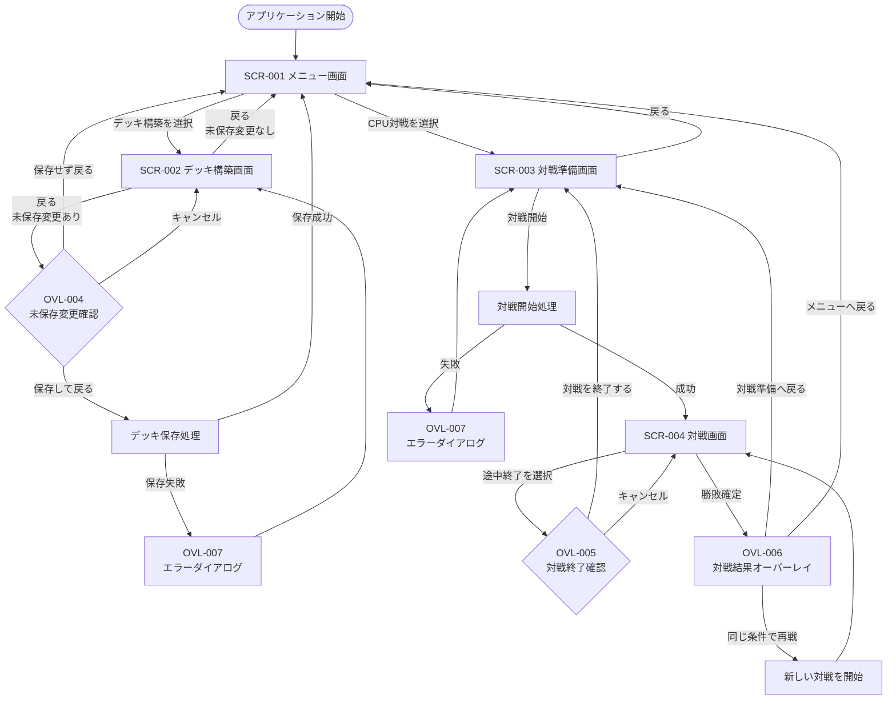

# Project Ankake 画面要件仕様書

## 1. 本仕様書の目的

本仕様書では、Project Ankakeに存在する以下のUI要件を定義する。

* 独立画面
* ダイアログおよびオーバーレイ
* 各画面の役割
* 画面間の遷移
* 遷移条件
* 遷移時のデータ保持および破棄

動作環境、システム構成、対象プラットフォームおよび実装範囲については、本仕様書では定義しない。

---

# 2. 画面一覧

## 2.1 独立画面一覧

| 画面ID    | 画面名     | 概要                                     |
| ------- | ------- | -------------------------------------- |
| SCR-001 | メニュー画面  | デッキ構築およびCPU対戦を開始するための起点となる画面           |
| SCR-002 | デッキ構築画面 | カード一覧からカードを選択し、対戦に使用するデッキを作成・編集する画面    |
| SCR-003 | 対戦準備画面  | プレイヤーとCPUが使用するデッキ、および先攻・後攻の決定方式を設定する画面 |
| SCR-004 | 対戦画面    | 選択したデッキを使用してCPUとの対戦を行う画面               |

---

## 2.2 SCR-001 メニュー画面

各機能へ移動するための起点となる画面とする。

主な機能は以下とする。

* デッキ構築画面へ移動する
* 対戦準備画面へ移動する

ゲーム終了操作は設けない。

---

## 2.3 SCR-002 デッキ構築画面

カード一覧からカードを選択し、対戦に使用するデッキを作成・編集する画面とする。

主な機能は以下とする。

* 保存済みデッキを選択する
* 新しいデッキを作成する
* デッキ名を設定する
* カード一覧を表示する
* カードを検索する
* カードを条件で絞り込む
* カードをデッキへ追加する
* カードをデッキから削除する
* デッキの合計枚数を確認する
* 同名カードの採用枚数を確認する
* デッキを保存する
* デッキを削除する
* カード詳細ダイアログを表示する
* メニュー画面へ戻る

保存済みデッキの一覧表示とデッキ編集は、別画面に分けず、本画面内で行う。

カードの詳細情報は、カード詳細ダイアログで表示する。

---

## 2.4 SCR-003 対戦準備画面

CPU対戦に使用するデッキおよび先攻・後攻の決定方式を設定し、対戦を開始する画面とする。

主な機能は以下とする。

* プレイヤーが使用する保存済みデッキを選択する
* CPUが使用する保存済みデッキを選択する
* 先攻・後攻の決定方式を選択する
* 選択したデッキの概要を確認する
* 対戦を開始する
* メニュー画面へ戻る

CPUが使用するデッキには、デッキ構築画面で作成・保存したデッキを選択できる。

CPUの強さおよび思考方式は1種類とし、プレイヤーが選択する設定項目は設けない。

先攻・後攻の決定方式は、以下から選択する。

| 設定値  | 内容                          |
| ---- | --------------------------- |
| ランダム | 対戦開始時にプレイヤーの先攻・後攻をランダムで決定する |
| 先攻   | プレイヤーを先攻とする                 |
| 後攻   | プレイヤーを後攻とする                 |

---

## 2.5 SCR-004 対戦画面

選択したデッキを使用して、CPUとの対戦を行う画面とする。

### 主な表示内容

* 盤面
* プレイヤーとCPUのクリーチャー
* プレイヤーとCPUのプレイヤー拠点
* 中立拠点
* 各拠点の現在体力
* 各中立拠点の所有状態
* プレイヤーの手札
* CPUの手札枚数
* プレイヤーとCPUのデッキ残り枚数
* プレイヤーとCPUの現在PPおよび最大PP
* 各レーンの属性共鳴値
* 各レーンの共鳴状態
* 現在のターン
* 現在のフェーズ
* プレイヤーターンの残り操作時間

CPUの手札内容は公開せず、手札枚数のみ表示する。

### 主な操作

* クリーチャーを召喚する
* クリーチャーを移動する
* スペルを発動する
* カード詳細ダイアログを表示する
* プレイフェーズを終了する
* 対戦を途中終了する

### 自動で進行する処理

* スタンバイフェーズ
* アタックフェーズ
* CPUのターン
* 勝敗判定

---

# 3. ダイアログ・オーバーレイ一覧

以下は独立した画面とせず、現在の画面上に重ねて表示する。

| UI ID   | 名称           | 使用画面         | 概要                            |
| ------- | ------------ | ------------ | ----------------------------- |
| OVL-001 | カード詳細ダイアログ   | デッキ構築画面、対戦画面 | カードイラスト、能力値および効果テキストなどを拡大表示する |
| OVL-002 | デッキ保存確認ダイアログ | デッキ構築画面      | デッキの保存または上書きを確認する             |
| OVL-003 | デッキ削除確認ダイアログ | デッキ構築画面      | 保存済みデッキの削除を確認する               |
| OVL-004 | 未保存変更確認ダイアログ | デッキ構築画面      | 未保存の変更がある状態で画面を離れる場合に表示する     |
| OVL-005 | 対戦終了確認ダイアログ  | 対戦画面         | 対戦を途中終了する場合に表示する              |
| OVL-006 | 対戦結果オーバーレイ   | 対戦画面         | 勝敗結果、対戦情報および対戦終了後の操作を表示する     |
| OVL-007 | エラーダイアログ     | 各画面          | 処理を続行できないエラーの内容を表示する          |
| OVL-008 | ローディングオーバーレイ | 各画面          | 処理中であることを表示し、必要に応じて操作を制限する    |

---

# 4. カード詳細ダイアログ

## 4.1 基本方針

カード詳細は、独立した画面や画面内の固定表示領域ではなく、現在の画面上にダイアログとして表示する。

カード詳細ダイアログの表示中は、原則として背面の画面を操作できない。

ダイアログを閉じた場合、表示前の画面および操作状態へ戻る。

---

## 4.2 表示内容

カード詳細ダイアログには、カードの種類および表示元に応じて以下を表示する。

* カード名
* カードイラスト
* カード種別
* 属性
* 元のコスト
* 現在のコスト
* 元の攻撃力
* 現在の攻撃力
* 元の最大体力
* 現在の最大体力
* 現在体力
* 元の移動力
* 現在の移動力
* 効果テキスト
* 対戦中に付与されている状態

デッキ構築画面では、原則としてカードの固定情報を表示する。

対戦画面では、対戦中の現在値および付与されている状態を表示する。

---

# 5. 対戦結果オーバーレイ

## 5.1 基本方針

対戦結果は独立した画面とせず、対戦画面上のオーバーレイとして表示する。

対戦結果オーバーレイの表示中は、盤面、手札および対戦操作を受け付けない。

---

## 5.2 表示内容

対戦結果オーバーレイには、以下を表示する。

* 勝利または敗北
* 勝敗が決定した理由
* 対戦時間
* 終了時のターン数
* 同じ条件で再戦するボタン
* 対戦準備画面へ戻るボタン
* メニュー画面へ戻るボタン

---

## 5.3 対戦時間

対戦開始処理が完了してから、勝敗が確定するまでの経過時間を表示する。

対戦結果オーバーレイの表示時間は、対戦時間に含めない。

途中終了した対戦では、対戦結果オーバーレイを表示しない。

---

## 5.4 ターン数

勝敗が確定した時点のターン数を表示する。

ターン数の詳細な数え方および表示形式は、対戦画面の詳細仕様で定義する。

---

# 6. 独立画面としない機能

## 6.1 カード一覧

カード一覧はデッキ構築画面内に表示し、独立したカード一覧画面は設けない。

## 6.2 保存済みデッキ一覧

保存済みデッキ一覧はデッキ構築画面内に表示し、独立したデッキ一覧画面は設けない。

## 6.3 カード詳細

カード詳細はカード詳細ダイアログとして表示し、独立したカード詳細画面は設けない。

## 6.4 対戦結果

対戦結果は対戦画面上のオーバーレイとして表示し、独立したリザルト画面は設けない。

## 6.5 CPU設定

CPUの強さおよび思考方式は1種類とし、CPU設定画面および強さの選択項目は設けない。

---

# 7. 画面遷移

## 7.1 画面遷移図

---

## 7.2 画面遷移一覧

| 遷移ID    | 遷移元         | 操作または条件                 | 遷移先          |
| ------- | ----------- | ----------------------- | ------------ |
| TRN-001 | アプリケーション開始  | 初期表示処理が完了する             | メニュー画面       |
| TRN-002 | メニュー画面      | デッキ構築を選択する              | デッキ構築画面      |
| TRN-003 | メニュー画面      | CPU対戦を選択する              | 対戦準備画面       |
| TRN-004 | デッキ構築画面     | 未保存の変更がない状態で戻る操作を行う     | メニュー画面       |
| TRN-005 | デッキ構築画面     | 未保存の変更がある状態で戻る操作を行う     | 未保存変更確認ダイアログ |
| TRN-006 | 対戦準備画面      | 戻る操作を行う                 | メニュー画面       |
| TRN-007 | 対戦準備画面      | 対戦開始条件を満たした状態で対戦開始を選択する | 対戦画面         |
| TRN-008 | 対戦画面        | 対戦の途中終了を選択する            | 対戦終了確認ダイアログ  |
| TRN-009 | 対戦終了確認ダイアログ | 対戦終了を確定する               | 対戦準備画面       |
| TRN-010 | 対戦画面        | 勝敗が確定する                 | 対戦結果オーバーレイ   |
| TRN-011 | 対戦結果オーバーレイ  | 同じ条件で再戦を選択する            | 対戦画面         |
| TRN-012 | 対戦結果オーバーレイ  | 対戦準備へ戻るを選択する            | 対戦準備画面       |
| TRN-013 | 対戦結果オーバーレイ  | メニューへ戻るを選択する            | メニュー画面       |

---

## 7.3 初期表示

アプリケーション開始時は、メニュー画面を表示する。

初期表示に必要な処理中は、ローディングオーバーレイを表示する。

初期表示処理が完了するまで、画面操作を受け付けない。

初期表示に失敗した場合は、エラーダイアログを表示する。

---

## 7.4 メニュー画面からの遷移

### デッキ構築画面への遷移

メニュー画面でデッキ構築を選択した場合、デッキ構築画面へ遷移する。

デッキ構築画面の表示に必要な以下の情報を読み込む。

* カード一覧
* 保存済みデッキ一覧

### 対戦準備画面への遷移

メニュー画面でCPU対戦を選択した場合、対戦準備画面へ遷移する。

対戦準備画面の表示に必要な保存済みデッキ一覧を読み込む。

---

## 7.5 デッキ構築画面からの遷移

### 未保存の変更がない場合

未保存の変更がない状態で戻る操作を行った場合、メニュー画面へ遷移する。

### 未保存の変更がある場合

未保存の変更がある状態で戻る操作を行った場合、未保存変更確認ダイアログを表示する。

未保存変更確認ダイアログでは、以下を選択できる。

| 選択肢    | 処理                        |
| ------ | ------------------------- |
| 保存して戻る | デッキを保存し、保存成功後にメニュー画面へ遷移する |
| 保存せず戻る | 未保存の変更を破棄し、メニュー画面へ遷移する    |
| キャンセル  | ダイアログを閉じ、デッキ構築画面に留まる      |

デッキの保存に失敗した場合はメニュー画面へ遷移せず、エラーダイアログを表示する。

---

## 7.6 対戦準備画面からの遷移

### メニュー画面へ戻る場合

戻る操作を行った場合、メニュー画面へ遷移する。

選択中のデッキおよび先攻・後攻の決定方式について、未保存変更確認は行わない。

### 対戦を開始する場合

以下をすべて満たす場合、対戦を開始できる。

* プレイヤーが使用するデッキが選択されている
* CPUが使用するデッキが選択されている
* プレイヤーのデッキが対戦可能な状態である
* CPUのデッキが対戦可能な状態である
* 先攻・後攻の決定方式が選択されている

対戦開始時に、以下の情報を対戦画面へ引き継ぐ。

* プレイヤーが使用するデッキ
* CPUが使用するデッキ
* 先攻・後攻の決定方式
* 対戦開始時に決定した実際の先攻・後攻

先攻・後攻の決定方式がランダムの場合、対戦開始時に実際の先攻・後攻を決定する。

対戦開始処理中はローディングオーバーレイを表示し、画面操作を受け付けない。

対戦開始処理に失敗した場合は、対戦準備画面に留まり、エラーダイアログを表示する。

---

## 7.7 対戦画面からの遷移

### 対戦を途中終了する場合

対戦中に途中終了操作を行った場合、対戦終了確認ダイアログを表示する。

| 選択肢     | 処理                      |
| ------- | ----------------------- |
| 対戦を終了する | 現在の対戦状態を破棄し、対戦準備画面へ遷移する |
| キャンセル   | ダイアログを閉じ、対戦画面に留まる       |

途中終了した対戦では、対戦結果オーバーレイを表示しない。

対戦準備画面へ戻った場合、直前に選択していた以下の設定を保持する。

* プレイヤーのデッキ
* CPUのデッキ
* 先攻・後攻の決定方式

### 勝敗が確定した場合

勝利条件または敗北条件が成立した場合、独立した画面へは遷移せず、対戦結果オーバーレイを表示する。

勝敗確定後は対戦操作を受け付けない。

---

## 7.8 対戦結果オーバーレイからの遷移

### 同じ条件で再戦する場合

直前の対戦と同じ以下の設定を使用して、新しい対戦を開始する。

* プレイヤーのデッキ
* CPUのデッキ
* 先攻・後攻の決定方式

先攻・後攻の決定方式がランダムの場合、再戦ごとに先攻・後攻を改めて決定する。

先攻または後攻が指定されている場合は、同じ設定を引き継ぐ。

直前の対戦状態は引き継がず、以下を初期状態へ戻す。

* デッキ
* 手札
* PP
* 盤面
* クリーチャー
* 拠点体力
* 中立拠点の所有状態
* 共鳴値
* 共鳴状態
* ターン数
* 対戦時間

### 対戦準備画面へ戻る場合

対戦準備画面へ遷移する。

直前に選択していた以下の設定を保持する。

* プレイヤーのデッキ
* CPUのデッキ
* 先攻・後攻の決定方式

### メニュー画面へ戻る場合

メニュー画面へ遷移する。

現在の対戦状態を破棄する。

---

# 8. ダイアログおよびオーバーレイの遷移ルール

## 8.1 基本ルール

ダイアログおよびオーバーレイの表示は、独立した画面遷移として扱わない。

表示中は、原則として背面の画面を操作できない。

ダイアログを閉じた場合、表示前の画面へ戻る。

---

## 8.2 カード詳細ダイアログ

カード詳細ダイアログを閉じた場合、表示前の画面および操作状態へ戻る。

カード詳細ダイアログの表示によって、以下の状態を変更しない。

* 選択中のカード
* 召喚操作の進行状態
* 移動操作の進行状態
* スペル発動操作の進行状態
* 対象選択状態

---

## 8.3 確認ダイアログ

キャンセルまたは閉じる操作を行った場合、ダイアログ表示前の画面および状態へ戻る。

確定操作を行った場合は、各ダイアログで定義された処理を実行する。

---

## 8.4 エラーダイアログ

処理を継続できるエラーの場合、エラーダイアログを閉じた後も、エラー発生前の画面に留まる。

現在の画面を継続できないエラーの場合は、メニュー画面へ戻る操作を表示する。

---

## 8.5 ローディングオーバーレイ

ローディングオーバーレイの表示中は、背面画面への入力を受け付けない。

処理完了後にローディングオーバーレイを閉じ、画面遷移または表示内容の更新を行う。

処理に失敗した場合はローディングオーバーレイを閉じ、エラーダイアログを表示する。

---

# 9. 画面遷移時の共通ルール

* 画面遷移処理中は、同じ遷移操作を複数回受け付けない。
* 画面遷移時は、遷移元画面に表示されていたダイアログおよびオーバーレイを閉じる。
* 遷移処理に失敗した場合は、原則として遷移元画面に留まる。
* 対戦画面から別の独立画面へ遷移した場合、現在の対戦状態を破棄する。
* デッキ構築画面の未保存変更は、保存または破棄が確定するまで保持する。
* 対戦準備画面へ戻る遷移では、直前に選択していた対戦条件を保持する。
* メニュー画面へ戻る遷移では、対戦状態を保持しない。
* 画面遷移完了前に、遷移先画面に対する操作を受け付けない。

---
